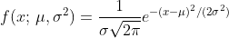

# Homework 1

## Objectives  :full_moon_with_face: 
The objectives of this homework assignment are the followings:

- Build your own RMarkdown document.
- Master different aspects of RMarkdown syntax.
- Become familiar with GitHub as a collaborative tool.

## Deadline :alarm_clock:
Submit the homework at last by Thursday 9th of October 2023 at 23:59pm
by pushing to the dedicated repository.

## Requirements :warning:
This homework **must** be accomplished using the appropriate GitHub template
and respect the following requirements:

- All members of the group must commit at least once.
- All commit messages must be reasonably clear and meaningful.
- Your GitHub repository must include at least the following:
  + One issue containing some form of __TO DO__ list.
  + One pull request followed by a merging.

## Content :rocket: 

In your repository, create a RMarkdown file called `hw1.Rmd` providing an HTML
output with the theme `cosmo` and syntax highlighting `rstudio`.
Use the font `Verdana` with size 16.
This file should contain the following elements:

+ A "title" section which should at least include:  
  - A title (e.g. Homework 1)  
  - The authors  
  - The date (think of using `Sys.time()`)  
+ A section called "Introduction" where you provide a short summary of
the structure of your homework. Moreover, record a short video to introduce
your group and include it in your RMarkdown document.  
+ A section called "Group Members". This section should have one subsection
for each group member in your team. For example, a group with three members
should have three subsections. Each of these subsections (named after each
group member) should include small biographies
containing at least the following elements:
  - An avatar picture. Make sure to include a caption for this image.
  Make sure all pictures have the same size.  
  - A paragraph describing your favorite hobby as well as one interesting fact
  about yourself (preferably true).  
  - Your favorite quote in blockquote format. Make sure to reference your quote
  using BibTex.  
  - A table having two columns (first column containing the classes you are
  following this semester; second column containing the time of these classes).
  - Add at least one emoji and one Giphy per group member.
  
+ A section called "RMarkdown Syntax", where you will demonstrate your
RMarkdown skills! In this section make sure to:
  - Illustrate an example to demonstrate a situation where caching a chunk
  using `cache = T` might not be beneficial. Provide a brief explanation of the
  results observed.
  - Generate 2000 random samples from a Poisson distribution with $\lambda = 2$
  using the function `rpois()`. Store these 2000 values in a vector called `y`.
  Then, compute the empirical mean and variance of `y`. Are these different
  from the theoretical values of mean and variance for a Poisson distribution,
  which both equal $\lambda$? If they are different, justify why this might be
  the case.
  - Create a graph to present the histogram of `y`. Set the number of bins to
  10 and make sure to include a caption for your figure. Now, change the number
  of bins to 50. How does the change in the number of bins affect the visual
  interpretation of the data?
  - Include the following equation: 
  - Include the following in-line equation:
  
  
  
  - Present the following quote in blue:
  "The only thing that is constant is change.", Heraclitus.
  - Insert a "Show/Hide Answer" button that reveals the solution to a given
  problem when clicked.
  - Insert a "color box" with the following text:
  "Learning never exhausts the mind." - Leonardo da Vinci
